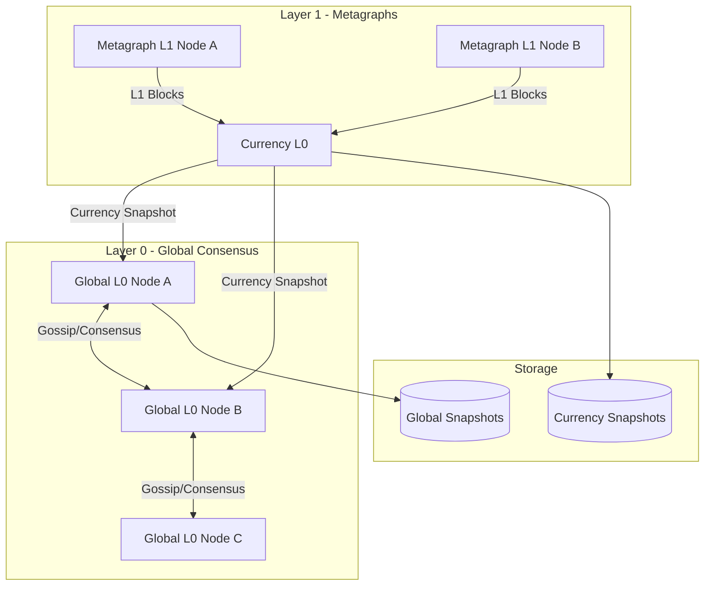
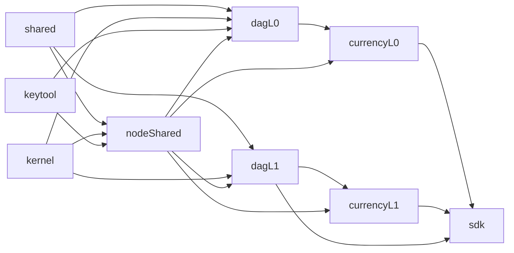
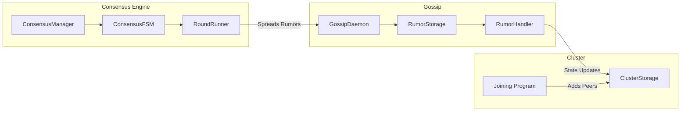
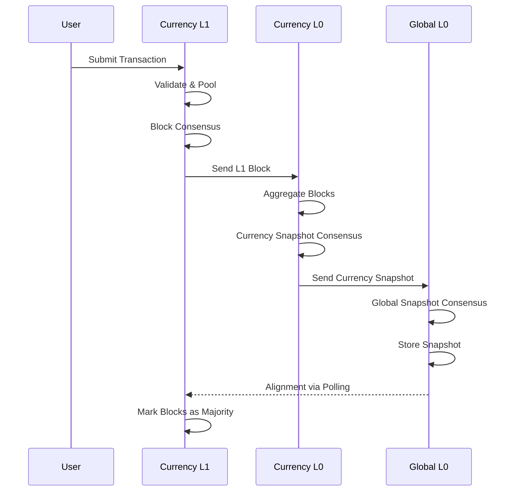
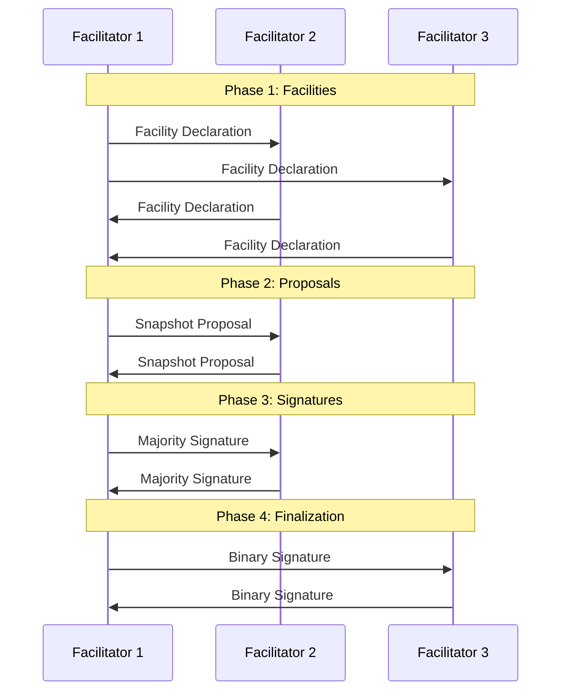

Tessellation implements a **hierarchical DAG consensus** model. Layer 1 metagraphs produce blocks, Currency Layer 0 nodes aggregate those blocks into currency snapshots, and Global Layer 0 nodes aggregate all currency snapshots into a single global snapshot representing the complete network state.

## Network topology

## Layers

### Global Layer 0 (`dag-l0`)

The Global L0 is the root of the network. It:

- Receives currency snapshots from all metagraph Currency L0 nodes via `POST /state-channels/{address}/snapshot`
- Receives L1 blocks directly via `POST /dag/l1-output`
- Runs multi-phase consensus among L0 validators to produce `GlobalIncrementalSnapshot` objects
- Distributes rewards — classic per-epoch or delegated-stake based, depending on the current epoch
- Computes Merkle Patricia Trie roots over the global state for verifiable state proofs
- Serves finalized snapshots via `GET /global-snapshots/{ordinal}`

**Entry point**: `Main.scala` extends `TessellationIOApp[Run]` with cluster ID `6d7f1d6a-213a-4148-9d45-d7200f555ecf`.

The application wires together `Storages`, `Services`, `Programs`, and `Daemons`, then starts three HTTP servers: public, P2P, and CLI.

**Snapshot creation flow**:
1. Events (L1 blocks and state channel snapshots) are enqueued via `L0Cell` — a hylomorphism from the `kernel` module.
2. The consensus daemon publishes events to facilitator peers.
3. Facilitators exchange proposals and collect signatures.
4. The snapshot is finalized and written to local filesystem storage.
5. Rewards are distributed based on epoch progress.

### DAG Layer 1 (`dag-l1`)

The L1 validator is responsible for metagraph-level block creation. It:

- Accepts transactions from users and pools them
- Triggers a block consensus round every 5 seconds when transactions are available
- Exchanges proposals with facilitator peers, merges and validates transactions, and produces a multi-signed block
- Gossips accepted blocks and forwards them to Global L0 via `L0BlockOutputClient.sendL1Output()`
- Aligns with L0 by polling for the latest `GlobalSnapshot` — an eventual consistency model

**Entry point**: `Main.scala` with cluster ID `17e78993-...`.

**L1 block creation flow**:
1. Own-round trigger fires (every 5 seconds if transactions are in the pool)
2. Proposal exchanged with facilitator peers
3. Transactions merged and validated
4. Multi-signed block created
5. Block gossiped and sent to Global L0
6. Background daemon accepts blocks into local DAG state

### Currency Layer 0 / Layer 1 (`currency-l0`, `currency-l1`)

Currency modules extend `dag-l0` and `dag-l1` with metagraph-specific logic:

| Aspect | DAG-L0/L1 | Currency-L0/L1 |
|--------|-----------|----------------|
| Snapshot type | `GlobalIncrementalSnapshot` | `CurrencyIncrementalSnapshot` |
| State scope | Global (all metagraphs) | Single metagraph |
| Data application | Not applicable | Optional custom consensus |
| Extension points | Minimal | Rewards, validators, data apps |

**Extension points for metagraph developers**:
- `dataApplication` — custom data block processing
- `rewards` — custom reward distribution logic
- `transactionValidator` — custom validation rules
- `customArtifacts` — additional snapshot artifacts

## Module dependency chain

- `dagL0` depends on: `kernel`, `shared`, `keytool`, `nodeShared`
- `dagL1` depends on: `kernel`, `shared`, `nodeShared`
- `currencyL0` / `currencyL1` depend on their respective dag layers plus `nodeShared`
- `sdk` aggregates `keytool`, `kernel`, `shared`, `nodeShared`, `currencyL0`, `currencyL1`, and `dagL1` in `provided` scope

## Consensus engine (`node-shared`)

The `node-shared` module (419k tokens — the largest in the codebase) provides the consensus infrastructure used by both L0 and L1.

### Consensus phases

Each consensus round progresses through five phases:

1. **CollectingFacilities** — nodes declare themselves as facilitators for the round
2. **CollectingProposals** — facilitators exchange snapshot proposals
3. **CollectingSignatures** — majority signatures are collected
4. **CollectingBinarySignatures** — binary (finalization) signatures are collected
5. **Finished** — the round is complete; snapshot is finalized

Stall detection runs with 100ms polling and timeout-based lock and acknowledgment spreading.

### Gossip protocol

The anti-entropy gossip layer uses two rumor types:

- **Peer rumors** — origin-specific with consecutive ordinals, ensuring ordered delivery per peer
- **Common rumors** — content-addressed by hash, for broadcast of shared state

Rumors are processed via Kleisli-based handler chains (`RumorHandler`) and stored in `RumorStorage`.

### Cluster membership

Nodes join the cluster via a two-way handshake implemented in `domain/cluster/programs/Joining.scala`. Peer membership is tracked in `ClusterStorage`. All P2P communication is authenticated via signature-based middleware (`PeerAuthMiddleware`).

## Key data structures

All core types live in `modules/shared`.

| Type | File | Description |
|------|------|-------------|
| `Transaction` | `schema/transaction.scala` | A transfer with amount, fee, and parent reference |
| `Block` | `schema/Block.scala` | A DAG block with parent references and a set of transactions |
| `GlobalSnapshot` | `schema/GlobalSnapshot.scala` | Full snapshot: balances, blocks, state channels |
| `GlobalIncrementalSnapshot` | `schema/GlobalIncrementalSnapshot.scala` | Delta snapshot between two ordinals |
| `Signed[A]` | `security/signature/Signed.scala` | Multi-signature wrapper with ECDSA |
| `Hash` | `security/Hash.scala` | SHA-256 hash with identity-based caching |

<Note>
  `Hash` uses `System.identityHashCode()` for its cache key — object identity, not equality. Do not rely on hash caching across deserializations of the same value.
</Note>

## Transaction lifecycle

<Info>
  L1 alignment with L0 is **poll-based, not push-based**. L1 nodes periodically pull the latest `GlobalSnapshot` from L0 — this is an eventual consistency model.
</Info>

## Consensus round sequence

## Naming conventions

All modules follow consistent naming conventions for navigating the codebase:

| Suffix | Role | Example |
|--------|------|---------|
| `*Storage` | Data access layer | `ClusterStorage`, `RumorStorage` |
| `*Service` | Business logic | `BlockService`, `CollateralService` |
| `*Client` | HTTP client | `P2PClient`, `L0BlockOutputClient` |
| `*Routes` | HTTP endpoint definitions | `GlobalSnapshotRoutes` |
| `*Daemon` | Long-running background fiber | `GossipDaemon`, `ConsensusDaemon` |
| `*Program` | High-level orchestration | `Joining`, `SnapshotProcessor` |

## State management patterns

Tessellation uses Cats Effect primitives for all mutable state:

- `Ref[F, A]` — single-value atomic state
- `MapRef[F, K, V]` — concurrent map
- `Queue[F, A]` — bounded or unbounded queues for event passing

State proofs are computed as Merkle Patricia Trie (MPT) roots over the global state at each snapshot ordinal — not per transaction.
