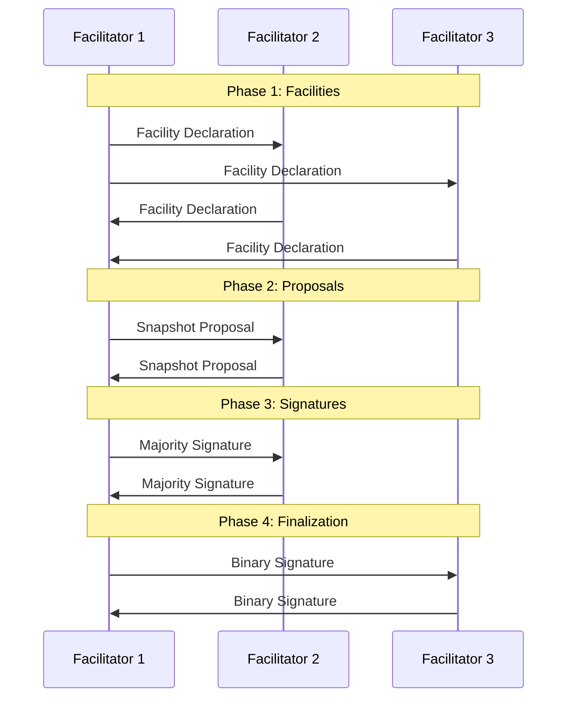

Tessellation reaches agreement through a **Directed Acyclic Graph (DAG)** consensus model rather than a linear chain. Instead of each block pointing to a single predecessor, blocks carry multiple parent references, allowing parallel transaction processing while still producing a deterministic, totally-ordered global history captured in snapshots.

## DAG vs chain-based consensus

| Property | Chain-based | DAG-based (Tessellation) |
|---|---|---|
| Block parents | Single predecessor | Multiple parent references (`NonEmptyList[BlockReference]`) |
| Throughput | Bounded by single producer | Parallel block creation across facilitators |
| Finality | Per-block | Per-snapshot (batched) |
| History | Linear chain | Partial order collapsed into ordered snapshots |
| Tip management | N/A | Active tips promoted / deprecated per snapshot (`SnapshotTips`) |

The `Block` type captures this structure directly:

```scala
case class Block(
  parent: NonEmptyList[BlockReference],
  transactions: NonEmptySet[Signed[Transaction]]
) extends Fiber[ParentBlockReference, BlockData]
```

Each block's `height` is derived from `parent.maximum.height.next`, so heights form a monotonically increasing partial order rather than a flat sequence.

## The five-phase consensus round

Every consensus round — whether at L1 (blocks) or L0 (snapshots) — progresses through exactly five phases tracked in `ConsensusState`:

```
CollectingFacilities
       │
       ▼
CollectingProposals
       │
       ▼
CollectingSignatures
       │
       ▼
CollectingBinarySignatures
       │
       ▼
Finished
```

<Steps>
  <Step title="CollectingFacilities">
    Each eligible peer broadcasts a **facility declaration** advertising its willingness to participate. The round cannot advance until all expected peers have declared or the stall timeout expires.
  </Step>
  <Step title="CollectingProposals">
    Active facilitators exchange **snapshot proposals** — their candidate artifacts (blocks for L1, snapshots for L0). A proposal contains the artifact and a hash that peers will vote on.
  </Step>
  <Step title="CollectingSignatures">
    Facilitators collect **majority signatures** over the agreed artifact hash. A quorum is required before proceeding.
  </Step>
  <Step title="CollectingBinarySignatures">
    A second round of signatures over the binary (serialized) representation of the artifact is collected. This guards against serialization ambiguity.
  </Step>
  <Step title="Finished">
    The outcome is stored and the next round key is derived with `key.next`. Rewards are distributed (L0 only) and the artifact is gossiped to the rest of the cluster.
  </Step>
</Steps>

## The FSM: ConsensusState, ConsensusRoundRunner, ConsensusManager

The engine is structured around three collaborating components defined in `node-shared/infrastructure/consensus/`:

<AccordionGroup>
  <Accordion title="ConsensusState">
    An immutable value type parameterised over `[Key, Status, Outcome, Kind]` that captures the full state of one in-flight round:

    ```scala
    case class ConsensusState[Key, Status, Outcome, Kind](
      key: Key,                              // e.g. SnapshotOrdinal(42)
      lastOutcome: Outcome,
      facilitators: Facilitators,            // active participants
      status: Status,                        // current phase
      createdAt: FiniteDuration,
      removedFacilitators: RemovedFacilitators,
      withdrawnFacilitators: WithdrawnFacilitators,
      eligibleFacilitators: EligibleFacilitators,
      lockStatus: LockStatus,                // Open | Closed | Reopened
      spreadAckKinds: Set[Kind]
    )
    ```

    `LockStatus` controls whether new facilitators may join mid-round. It is set to `Closed` during stall detection and reset to `Reopened` once the stall is resolved.
  </Accordion>
  <Accordion title="ConsensusRoundRunner">
    Runs a single round and its associated stall-detection monitor fiber. The runner:
    - Calls `creator.tryFacilitateConsensus` to initialise state for the new key.
    - Spawns a `roundMonitor` fiber that polls every 100 ms for stalls.
    - Drives state transitions by enqueuing `ConsensusCommand` values on an internal queue.
    - After the round completes, calls `afterConsensusFinish` to schedule the next trigger (`TimeTrigger` or `EventTrigger`).
  </Accordion>
  <Accordion title="ConsensusManager">
    A thin façade that other parts of the system call to interact with consensus without touching internal queues directly:

    ```scala
    trait ConsensusManager[F[_], Event, Key, Artifact, Context, Status, Outcome, Kind] {
      def registerForConsensus(observationKey: Key): F[Unit]
      def startFacilitatingAfterDownload(key: Key, lastArtifact: Signed[Artifact], lastContext: Context): F[Unit]
      def startFacilitatingAfterRollback(lastKey: Key, initialOutcome: Outcome): F[Unit]
      def withdrawFromConsensus: F[Unit]
    }
    ```

    All methods are non-blocking — they enqueue a `ConsensusCommand` and return immediately.
  </Accordion>
</AccordionGroup>

## L1 block consensus (5 s trigger)

The Layer 1 block consensus is triggered every five seconds when transactions are available in the mempool.

<Steps>
  <Step title="Own-round trigger fires">
    The `StateChannel` schedules a `TimeTrigger` at a fixed interval (`timeTriggerInterval`). If pending transactions exist, an `EventTrigger` can also start a round immediately.
  </Step>
  <Step title="Proposal exchange">
    The initiating facilitator picks its transactions, creates a candidate `Block`, and sends a proposal to the other facilitators. Proposals are validated and merged.
  </Step>
  <Step title="Signature collection">
    Facilitators sign the agreed block hash. A multi-signed `Signed[Block]` is produced once the majority threshold is met.
  </Step>
  <Step title="Gossip and L0 forwarding">
    The finalised block is gossiped across the cluster and forwarded to Layer 0 via `L0BlockOutputClient.sendL1Output()`.
  </Step>
  <Step title="Block acceptance">
    A background daemon accepts blocks into local state. L0 alignment is achieved by polling `GlobalL0Service.pullGlobalSnapshot()` — L1 does not push to L0; it polls for the latest confirmed global snapshot.
  </Step>
</Steps>

## L0 snapshot consensus

The Global L0 consensus aggregates events from all metagraphs into a `GlobalIncrementalSnapshot`.

1. **Events enqueued** — L1 blocks and state-channel snapshots arrive at the `L0Cell`, which processes them with a hylomorphism (unfold → fold).
2. **Facilitators selected** — The `FacilitatorSelector` chooses a deterministic set of peers based on the current cluster membership and trust scores (EigenTrust + DATT + Self-Avoiding Walk).
3. **Proposals created** — Each facilitator builds a candidate `GlobalIncrementalSnapshot` containing the events it collected.
4. **Signatures collected** — The five-phase FSM collects majority and binary signatures.
5. **Rewards distributed** — After `Finished`, the reward engine runs classic or delegated reward distribution depending on the current `EpochProgress`.

## Consensus round sequence diagram



## Stall detection

A round is considered **stalled** when a phase has not advanced within `declarationTimeout`. The `roundMonitor` fiber (started per round, not per phase) handles this:

<Info>
  The monitor polls every **100 ms** by default, backing off exponentially up to **1 000 ms** when nothing changes.
</Info>

```
roundMonitor loop:
  1. Check if state is gone or outcome is ready → stop
  2. Compute hash of current resources (declarations received)
  3. If statusDuration >= declarationTimeout AND not already locked:
     a. Log stall warning with missing peer IDs
     b. Increment dag_consensus_stall_detected metric
     c. tryLockConsensus → set LockStatus = Closed
     d. spreadAckIfCollecting → re-spread acks to missing peers
  4. If stallCycleCount >= maxStallCycles AND still Closed:
     a. Log error and increment dag_consensus_round_abandoned metric
     b. Remove stale Closed state from storage
     c. Enqueue RoundCompleted so next round can start
```

The lock/ack spreading mechanism is designed to recover from transient network partitions by re-broadcasting missing acknowledgements rather than immediately abandoning the round.

<Warning>
  A node in its **joining grace period** uses `timeTriggerInterval` as its declaration timeout instead of the shorter `declarationTimeout`, giving it more time to catch up with the cluster.
</Warning>
