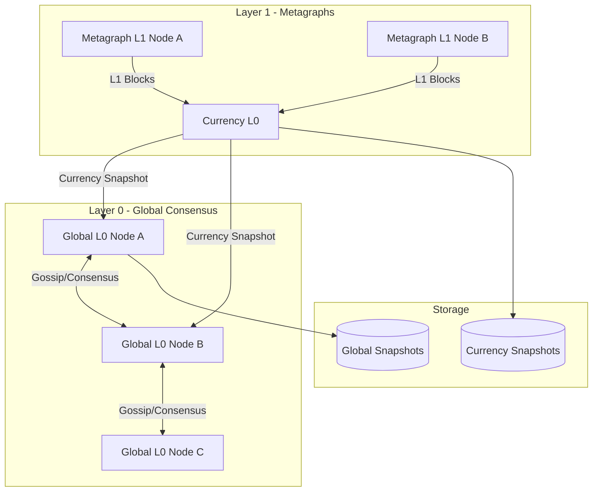

A **metagraph** is an isolated state channel with its own Layer 1 validator network. Metagraphs run independent consensus, maintain their own ledger state, and periodically submit signed `CurrencyIncrementalSnapshot` artifacts to the Global L0 for inclusion in the global DAG.

This design allows metagraph developers to customise consensus logic, validation rules, and reward distribution without modifying the core Tessellation codebase.



## Currency L0 vs DAG L0

| Aspect | DAG L0 / DAG L1 | Currency L0 / Currency L1 |
|---|---|---|
| Snapshot type | `GlobalIncrementalSnapshot` | `CurrencyIncrementalSnapshot` |
| State scope | Global (all metagraphs) | Single metagraph |
| Data application | Not available | Optional custom data block processing |
| Extension points | Minimal | `rewards`, `transactionValidator`, `dataApplication`, `customArtifacts` |
| Entry point | `dag-l0/Main.scala` | `CurrencyL0App` / `CurrencyL1App` |
| Cluster ID | `6d7f1d6a-...` | Developer-assigned per metagraph |

## State channel model

The metagraph lifecycle follows a three-layer hierarchy:

<Steps>
  <Step title="L1 block creation">
    Metagraph L1 nodes run their own block consensus round (triggered every 5 s or by events). Validated transactions are assembled into `Block` values with multi-parent DAG references and sent to Currency L0 via `L0BlockOutputClient.sendL1Output()`.
  </Step>
  <Step title="Currency L0 snapshot consensus">
    `CurrencyL0` aggregates incoming L1 blocks into a `CurrencyIncrementalSnapshot`. It runs the same five-phase FSM as the Global L0, producing a signed snapshot scoped to the single metagraph.
  </Step>
  <Step title="Submission to Global L0">
    The signed `CurrencyIncrementalSnapshot` is submitted to Global L0 as a `StateChannelSnapshotBinary` via:

    ```
    POST /state-channels/{address}/snapshot
    ```

    Global L0 includes it in the next `GlobalIncrementalSnapshot` under `stateChannelSnapshots`.
  </Step>
  <Step title="Alignment polling">
    L1 nodes poll Global L0 with `GlobalL0Service.pullGlobalSnapshot()` to detect when their blocks have been confirmed. This is an eventual-consistency pull model — L1 does not receive push notifications.
  </Step>
</Steps>

## Extension points for metagraph developers

The `CurrencyL0App` / `CurrencyL1App` base classes expose four override points:

<AccordionGroup>
  <Accordion title="dataApplication">
    Provide a `BaseDataApplicationL0Service[IO]` resource to add custom data block processing. The service participates in currency snapshot consensus and can validate, accept, or reject custom data payloads alongside ordinary transactions.

    ```scala
    def dataApplication: Option[Resource[IO, BaseDataApplicationL0Service[IO]]] = None
    ```
  </Accordion>
  <Accordion title="rewards">
    Override the reward distribution logic used after each `CurrencyIncrementalSnapshot` is finalised. The type is:

    ```scala
    def rewards(
      implicit sp: SecurityProvider[IO]
    ): Option[Rewards[IO, CurrencySnapshotStateProof, CurrencyIncrementalSnapshot, CurrencySnapshotEvent]] = None
    ```

    When `None`, no metagraph-level rewards are distributed (DAG rewards still apply at the global layer).
  </Accordion>
  <Accordion title="customArtifacts">
    Inject additional `SharedArtifact` values into each currency snapshot without implementing a full data application:

    ```scala
    def customArtifacts(
      lastCurrencySnapshot: Signed[CurrencyIncrementalSnapshot]
    ): Option[SortedSet[SharedArtifact]] = None
    ```
  </Accordion>
  <Accordion title="transactionValidator">
    Plug in custom validation logic for transactions before they are accepted into a block. Registered through the `Validators` module during service wiring.
  </Accordion>
</AccordionGroup>

## CurrencyL0App / CurrencyL1App entry points

Metagraph projects extend `CurrencyL0App` and provide their metagraph's `ClusterId` and version metadata:

```scala
abstract class CurrencyL0App(
  name: String,
  header: String,
  clusterId: ClusterId,
  tessellationVersion: TessellationVersion,
  metagraphVersion: MetagraphVersion
) extends TessellationIOApp[Run] with OverridableL0
```

The `OverridableL0` trait declares all four extension points with default `None` implementations so metagraph projects only override what they need:

```scala
trait OverridableL0 extends TessellationIOApp[Run] {
  def dataApplication: Option[Resource[IO, BaseDataApplicationL0Service[IO]]] = None

  def rewards(
    implicit sp: SecurityProvider[IO]
  ): Option[Rewards[IO, CurrencySnapshotStateProof, CurrencyIncrementalSnapshot, CurrencySnapshotEvent]] = None

  def customArtifacts(
    lastCurrencySnapshot: Signed[CurrencyIncrementalSnapshot]
  ): Option[SortedSet[SharedArtifact]] = None
}
```

## L1–L0 interaction

| Direction | Mechanism | Description |
|---|---|---|
| L1 → Currency L0 | `L0BlockOutputClient.sendL1Output()` | Forwards finalised L1 blocks |
| Currency L0 → Global L0 | `POST /state-channels/{address}/snapshot` | Submits the metagraph's currency snapshot |
| L1 ← Global L0 | `GlobalL0Service.pullGlobalSnapshot()` (polling) | L1 aligns with the confirmed global state |

<Note>
  The alignment from Global L0 back to L1 is **poll-based**, not push-based. L1 nodes periodically query the Global L0 to check whether their blocks have been included in a global snapshot, then mark those blocks as majority-confirmed.
</Note>

## SDK dependency

Metagraph projects depend on the `sdk` module with `provided` scope to access all Tessellation functionality through a stable API façade:

```scala
// build.sbt
libraryDependencies += "io.constellationnetwork" %% "tessellation-sdk" % tessellationVersion % Provided
```

Key SDK exports:
- `SecurityProvider[F]` — cryptographic operations
- `keypair.generate[F]` — key pair generation
- All core schema types and consensus infrastructure

<Tip>
  See the [getting started guide](/sdk/getting-started) for a step-by-step walkthrough of setting up a new metagraph project.
</Tip>
