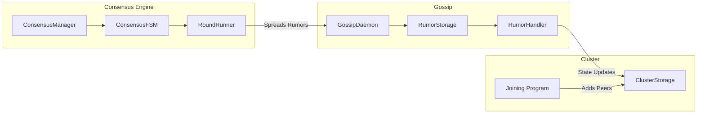

Tessellation's peer-to-peer layer handles cluster membership, state propagation, and peer authentication. The core infrastructure lives in `node-shared/infrastructure/` and is shared by all node types (DAG L0, DAG L1, Currency L0, Currency L1).



## Cluster membership

### Joining protocol (two-way handshake)

Joining is orchestrated by `domain/cluster/programs/Joining.scala`. The protocol is a verified two-way handshake:

<Steps>
  <Step title="Validate join conditions">
    The joining node checks its own `NodeState` to confirm it is allowed to join (e.g., `ReadyToJoin`). A session is created via `session.createSession`.
  </Step>
  <Step title="Fetch registration request">
    The joiner calls `signClient.getRegistrationRequest` on the target peer to obtain its `RegistrationRequest` (ID, IP, port, cluster session, software version, environment).
  </Step>
  <Step title="Validate handshake">
    The joiner verifies:
    - Software version hash matches
    - Metagraph version hash matches
    - `AppEnvironment` matches (Dev / Testnet / Mainnet)
    - Cluster ID matches
    - Cluster session token matches (or is not yet set)
    - Peer is on the seedlist
    - Allowance list matches
  </Step>
  <Step title="Sign challenge">
    A UUID-based `SignRequest` is sent to the peer. The peer signs it and returns `Signed[SignRequest]`. The joiner verifies the signature against the peer's declared ID.
  </Step>
  <Step title="Send join request">
    The joiner sends its own `JoinRequest` to the peer, which runs the same handshake in the opposite direction (`skipJoinRequest = true` to avoid infinite recursion).
  </Step>
  <Step title="Register peer">
    On success, the peer is added to `ClusterStorage` via `clusterStorage.addPeer(peer)` and peer discovery begins to find additional cluster members.
  </Step>
</Steps>

### ClusterStorage and peer tracking

`ClusterStorage` is the in-memory registry of all known peers:

- Stores `Peer` records indexed by `PeerId`
- Exposes a `peerChanges` stream (`fs2.Stream[F, Ior[Peer, Peer]]`) that other subsystems subscribe to (e.g., `GossipDaemon` uses it to detect when the first `Ready` peer appears before starting gossip).
- Tracks `responsivePeers` — peers that have passed liveness checks.

## Gossip protocol

Tessellation uses an **anti-entropy gossip** protocol to propagate state changes across the cluster. The protocol is implemented in `GossipDaemon` and operates two independent round runners.

### Two types of rumors

<CardGroup cols={2}>
  <Card title="Peer rumors" icon="user">
    Origin-specific messages from a single node. Each peer's rumors are sequenced with **consecutive ordinals** (`Ordinal(generation, counter)`). A peer rumor is only accepted if its counter is exactly one greater than the last accepted counter for that origin (`addPeerRumorIfConsecutive`). This ensures ordered, exactly-once delivery per origin.
  </Card>
  <Card title="Common rumors" icon="globe">
    Content-addressed by SHA-256 **hash**. Any node may produce a common rumor and it is deduplicated globally by hash. Common rumors are accepted if they have not been seen before (`addCommonRumorIfUnseen`). There is no ordering requirement between common rumors.
  </Card>
</CardGroup>

### Gossip round mechanics

The `GossipDaemon` runs two concurrent round loops:

**Peer rumor round** (`peerRound`):
1. Fetch the last known ordinals for each peer from `RumorStorage`.
2. Compute `nextOrdinals = lastOrdinals.mapValues(o => Ordinal(o.generation, o.counter.next))`.
3. Query a randomly selected peer for rumors starting at those ordinals.
4. Enqueue received rumors for validation and handling.

**Common rumor round** (`commonRound`):
1. Request the remote peer's set of active common rumor hashes (`getCommonRumorOffer`).
2. Diff against locally seen hashes.
3. Fetch the missing rumors (`queryCommonRumors`).
4. Enqueue for validation and handling.

### Collateral verification

Before a rumor is processed, the gossip daemon verifies that all signers of the rumor have sufficient **collateral** staked. Rumors from nodes without collateral are silently discarded.

## GossipDaemon, RumorStorage, RumorHandler

### GossipDaemon

```scala
trait GossipDaemon[F[_]] {
  def startAsInitialValidator: F[Unit]   // genesis / rollback path
  def startAsRegularValidator: F[Unit]   // normal join path
}
```

`startAsRegularValidator` waits for the first `Ready` peer to appear in `ClusterStorage`, initialises rumor storage from that peer, then starts both round runners and the rumor consumer.

### RumorStorage

In-memory store backed by `Ref` and `MapRef` (from Cats Effect):

| Method | Description |
|---|---|
| `addPeerRumorIfConsecutive` | Accepts peer rumor only if ordinal is exactly next; returns `AddSuccess`, `CounterTooHigh`, `CounterTooLow`, or `GenerationTooLow` |
| `addCommonRumorIfUnseen` | Accepts common rumor if its hash has not been seen; maintains LRU-bounded seen/active sets |
| `getPeerRumorsFromCursor` | Returns rumors for a peer starting from a given ordinal cursor |
| `getCommonRumorSeenHashes` | Returns the full set of hashes seen (used in exchange during round) |

### RumorHandler (Kleisli-based)

Handlers are `Kleisli[OptionT[F, *], (RumorRaw, PeerId), Unit]` functions — they return `OptionT` so that multiple handlers can be composed with `<+>` (SemigroupK) and the first matching handler wins:

```scala
// Construct a handler for a specific common rumor type
RumorHandler.fromCommonRumorConsumer[F, MyType] { rumor =>
  // handle rumor.content: MyType
}

// Construct a handler for a peer-origin rumor type
RumorHandler.fromPeerRumorConsumer[F, MyType]() { rumor =>
  // handle PeerRumor(origin, ordinal, content)
}

// Compose multiple handlers
val combined: RumorHandler[F] = handler1 <+> handler2 <+> handler3
```

Content-type matching is done at compile time via `TypeTag` — no runtime class casting.

## Peer authentication

All P2P HTTP endpoints are protected by `PeerAuthMiddleware`, which validates that incoming requests carry a valid **signature** from a known peer:

- The middleware extracts the peer's `Id` from the request headers.
- It verifies the ECDSA signature over the request using the peer's public key (derived from `Id`).
- Requests from peers not in `ClusterStorage` or with invalid signatures are rejected.

Outgoing P2P requests are signed by `httpSignerCore` / `httpSignerHttp4s` libraries, which intercept the HTTP4s request pipeline and attach the node's signature headers before sending.

## Anti-entropy: state synchronisation

The gossip protocol acts as the anti-entropy mechanism for Tessellation:

1. **New node joins** — `startAsRegularValidator` fetches initial peer and common rumors from the first discovered `Ready` peer, seeding its `RumorStorage` with current state.
2. **Ongoing sync** — Round runners continuously exchange rumor ordinals and hashes with randomly chosen peers, pulling any missing entries.
3. **Consensus declarations** — Each consensus phase declaration (facility, proposal, signature) is spread as a rumor, ensuring all facilitators receive all declarations even under partial network partitions.
4. **Stall recovery** — When the consensus monitor detects a stall, `spreadAckIfCollecting` re-broadcasts acknowledgement rumors to any peers that have not yet responded.

<Note>
  The gossip layer is responsible for propagating **consensus declarations** between facilitators. If gossip delivery is delayed, the stall detector will re-spread acks after `declarationTimeout` elapses.
</Note>
