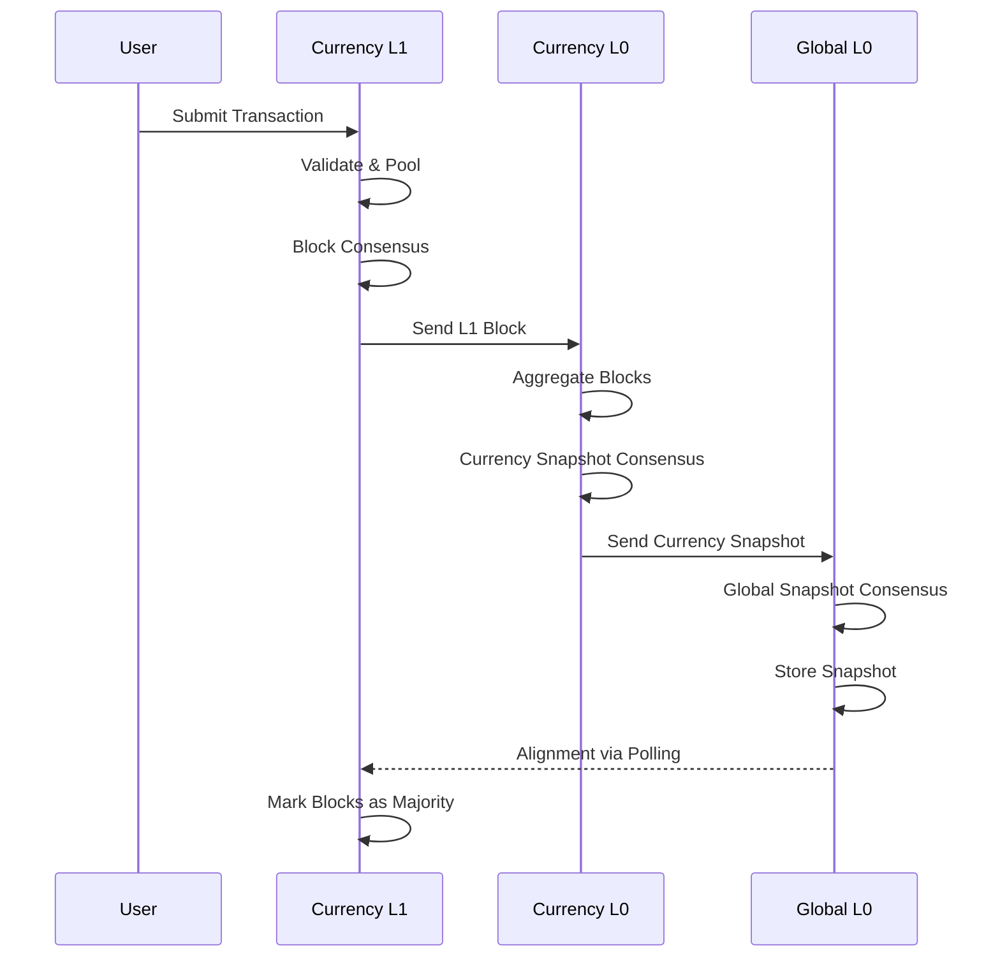

A **snapshot** is the fundamental unit of finality in Tessellation. Rather than finalising transactions individually, the network batches blocks and metagraph state into periodic snapshots that serve as checkpoints. Each snapshot is cryptographically chained to its predecessor, producing a verifiable history of the entire network state.

## Snapshot types

Tessellation defines two paired snapshot families — one for the global DAG and one for individual metagraphs — each with a **full** variant (genesis or migration) and an **incremental** variant (normal operation).

<CardGroup cols={2}>
  <Card title="GlobalSnapshot" icon="globe">
    The genesis snapshot type. Contains the complete ledger state: all balances, all blocks, all state-channel snapshots, and reward transactions. Used only at network initialisation via `GlobalSnapshot.mkGenesis`.
  </Card>
  <Card title="GlobalIncrementalSnapshot" icon="circle-half-stroke">
    The normal operating type. A **delta** relative to the previous snapshot — it carries only what changed, plus a `stateProof` that commits to the full state via Merkle roots.
  </Card>
  <Card title="CurrencySnapshot" icon="coins">
    Full snapshot for a single metagraph (currency L0). Used at metagraph genesis. Analogous to `GlobalSnapshot` but scoped to one state channel.
  </Card>
  <Card title="CurrencyIncrementalSnapshot" icon="arrow-trend-up">
    Delta snapshot for a metagraph. Submitted by `CurrencyL0` to `GlobalL0` via `POST /state-channels/{address}/snapshot`.
  </Card>
</CardGroup>

### GlobalIncrementalSnapshot fields

```scala
case class GlobalIncrementalSnapshot(
  ordinal: SnapshotOrdinal,
  height: Height,
  subHeight: SubHeight,
  lastSnapshotHash: Hash,            // links to previous snapshot
  blocks: SortedSet[BlockAsActiveTip],
  stateChannelSnapshots: SortedMap[Address, NonEmptyList[Signed[StateChannelSnapshotBinary]]],
  rewards: SortedSet[RewardTransaction],
  delegateRewards: Option[SortedMap[PeerId, Map[Address, Amount]]],
  epochProgress: EpochProgress,
  nextFacilitators: NonEmptyList[PeerId],
  tips: SnapshotTips,
  stateProof: GlobalSnapshotStateProof,  // Merkle roots — see below
  allowSpendBlocks: Option[SortedSet[Signed[AllowSpendBlock]]],
  tokenLockBlocks: Option[SortedSet[Signed[TokenLockBlock]]],
  // ... additional optional fields for delegated stakes, node collaterals, etc.
  version: SnapshotVersion
)
```

Fields that are `Option[...]` default to `Some(SortedSet.empty)` / `Some(SortedMap.empty)` when absent, preserving backward compatibility with `GlobalIncrementalSnapshotV1`.

## The snapshot ordinal system

Every snapshot is identified by a `SnapshotOrdinal`, a refined non-negative `Long`:

```scala
case class SnapshotOrdinal(value: NonNegLong)
```

Ordinals are strictly increasing — the `Next[SnapshotOrdinal]` instance always adds `1`. The genesis snapshot starts at `SnapshotOrdinal.MinValue` (ordinal 0). Incremental snapshots begin at `MinIncrementalValue` (ordinal 1).

The ordinal is the primary key for snapshot queries and consensus round identification:

```
GET /global-snapshots/{ordinal}
```

<Note>
  `SnapshotOrdinal` uses a refined type (`NonNegLong`) for compile-time validation — negative ordinals cannot be constructed.
</Note>

## Snapshot creation flow



<Steps>
  <Step title="Events enqueued via L0Cell">
    Incoming L1 blocks and state-channel snapshots are processed by `L0Cell` using a hylomorphism (unfold → fold). Events are enqueued and made available to the consensus daemon.
  </Step>
  <Step title="Consensus daemon publishes to facilitators">
    The consensus daemon selects facilitators and distributes the pending events. Each facilitator independently builds a candidate `GlobalIncrementalSnapshot`.
  </Step>
  <Step title="Facilitators create proposal artifacts">
    A proposal includes the candidate snapshot, its hash, and the facilitator's signature. Proposals are exchanged peer-to-peer during `CollectingProposals`.
  </Step>
  <Step title="Signatures collected, snapshot finalised">
    Majority and binary signatures are gathered (phases 3 and 4 of the FSM). The snapshot is considered final once `Finished` is reached.
  </Step>
  <Step title="Rewards distributed">
    The reward engine runs classic or delegated reward logic based on `EpochProgress`. Reward transactions are included in the `rewards` field of the next snapshot.
  </Step>
</Steps>

## State proofs: Merkle Patricia Trie roots

Each `GlobalIncrementalSnapshot` embeds a `GlobalSnapshotStateProof` that commits to the full current ledger state without repeating it:

```scala
case class GlobalSnapshotStateProof(
  lastStateChannelSnapshotHashesProof: Hash,  // MPT root over state-channel hashes
  lastTxRefsProof: Hash,                      // MPT root over last tx refs per address
  balancesProof: Hash,                        // MPT root over all balances
  lastCurrencySnapshotsProof: Option[MerkleRoot],
  activeAllowSpends: Option[Hash],
  activeTokenLocks: Option[Hash],
  tokenLockBalances: Option[Hash],
  lastAllowSpendRefs: Option[Hash],
  lastTokenLockRefs: Option[Hash],
  updateNodeParameters: Option[Hash],
  activeDelegatedStakes: Option[Hash],
  delegatedStakesWithdrawals: Option[Hash],
  activeNodeCollaterals: Option[Hash],
  nodeCollateralWithdrawals: Option[Hash],
  priceState: Option[Hash],
  lastGlobalSnapshotsWithCurrency: Option[Hash],
  mptRoot: Option[Hash]
) extends StateProof
```

<Info>
  State proofs are computed **per snapshot**, not per transaction. The Merkle Patricia Trie implementation lives in `shared/security/mpt/` and produces roots over sorted maps of state, enabling compact inclusion proofs.
</Info>

The proof is recomputed during consensus by `gsi.stateProof[F](ordinal)` before the candidate snapshot is included in a proposal.

## Storage and querying

Finished snapshots are persisted and exposed through the Global L0 HTTP API:

```bash
# Retrieve a snapshot by ordinal
GET /global-snapshots/{ordinal}

# Submit a metagraph snapshot to Global L0
POST /state-channels/{address}/snapshot

# Submit L1 blocks to Global L0
POST /dag/l1-output
```

The snapshot storage layer uses the ordinal as a primary key, allowing point-in-time queries and incremental sync. Nodes that rejoin the cluster download the latest snapshot and reconstruct state from the embedded `stateProof` and `info` fields.

<Tip>
  The `SnapshotMetadata` type (`ordinal`, `hash`, `lastSnapshotHash`) provides a lightweight reference to a snapshot without downloading the full payload, useful for chain validation and sync checks.
</Tip>
